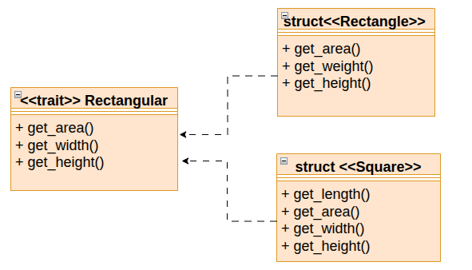

# UML Trait Diagram Example 

## Description 

This repository is for educational purpose. 
It is a simple Rust program that implements geometric shapes in traits programming. 
The following image represents a trait diagram for this example. 


## Execution 
To execute this program, we simply run: 
``` 
Cargo run 
``` 


## The Output

This program will simply print the following output: 
 
``` 
rect has width 2, height3, and area6
square has length5 and area 25
```  
